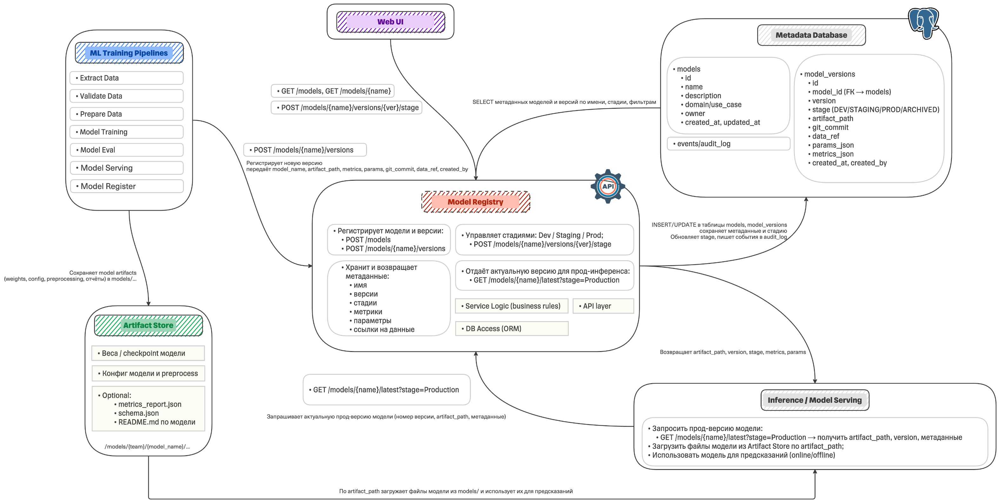

# ML Model Registry

A lightweight, self‑contained **Model Registry** built from scratch to bring order to the chaos of unstructured model storage.  
Designed for internal ML teams, it provides a central place to track model metadata, manage version lifecycles, and serve production‑ready models with confidence.

[](https://python.org)
[](https://fastapi.tiangolo.com)
[](https://sqlalchemy.org)
[](https://redis.io)
[](https://prometheus.io)
[](https://grafana.com)
[](https://pytorch.org)
[](https://docker.com)

---

## Table of Contents

- [Problem Statement](#problem-statement)
- [Requirements](#requirements)
- [Architecture](#architecture)
- [Technology Choices](#technology-choices)
- [Database Schema](#database-schema)
- [API Overview](#api-overview)
- [Getting Started](#getting-started)
- [Usage Examples](#usage-examples)
- [Monitoring](#monitoring)
- [Project Structure](#project-structure)
- [Future Work](#future-work)

---

## Problem Statement

ML teams currently store trained models in a shared file system using arbitrary folder names:

```
models/
├── mlds_1/my_model_v1/
├── mlds_3/sft_modell_v_123/
├── mlds_180/model_v1_v0_with_rank_dataset_0/
├── mlds_180/model_v1_v0_with_rank_dataset_1/
└── mlds_180/model_v1_v0_without_rank_dataset_0/
```

**Problems identified:**
- No standardised naming or versioning
- No metadata (metrics, parameters, data source, author)
- No way to track which model is in production
- Manual, error‑prone deployment process
- No audit trail or stage transitions

---

## Requirements

### Functional
- Register a model (name, description, domain, owner)
- Register a new model version with:
  - artifact path, git commit, data reference
  - training parameters, evaluation metrics
  - training environment, pipeline version, run ID
- Assign life‑cycle stages: `DEV` → `STAGING` → `PRODUCTION` → `ARCHIVED`
- Retrieve the latest model version for a given stage (with Redis caching)
- List all models and their versions
- Simple web UI to view and promote models
- Expose Prometheus metrics for monitoring

### Non‑Functional
- Lightweight, easy to run locally (SQLite, Redis optional)
- API‑first design with OpenAPI documentation
- Extensible metadata storage (JSON for params/metrics)
- Minimal latency for production reads (caching)
- Containerised supporting services (Prometheus, Grafana, Redis)

---

## Architecture




**Flow description:**
1. **Training pipelines** produce model artifacts and register metadata via the Registry API.
2. The **Registry** stores metadata in SQLite/Postgres and caches the latest version per stage in Redis.
3. **Serving services** query the Registry for the current production version and load the model from the artifact store.
4. The **Web UI** allows humans to browse models and promote versions.
5. **Prometheus** scrapes metrics for monitoring request rates and latencies.

---

## Technology Choices

| Component           | Technology       | Justification |
|---------------------|------------------|---------------|
| **API Framework**   | FastAPI          | High performance, automatic OpenAPI docs, easy async support |
| **Metadata DB**     | SQLAlchemy + SQLite (dev) / PostgreSQL (prod) | Lightweight for local, but schema is portable |
| **Caching**         | Redis            | In‑memory store for low‑latency reads of latest versions |
| **Artifact Store**  | Local filesystem (extensible to S3) | Simple start; can be replaced with cloud storage |
| **Monitoring**      | Prometheus + Grafana | Industry standard, easy integration with FastAPI |
| **Containerisation**| Docker Compose   | Spin up all dependencies (Redis, Prometheus, Grafana) quickly |
| **ML Framework**    | PyTorch (examples) | Used to demonstrate training/serving; registry is framework‑agnostic |

---

## Database Schema

### `models`
| Column      | Type         | Description |
|-------------|--------------|-------------|
| id          | Integer (PK) |             |
| name        | String(255)  | Unique model name |
| description | Text         |             |
| domain      | String(255)  | e.g., fraud_detection |
| owner       | String(255)  | Team name   |
| created_at  | DateTime     |             |
| updated_at  | DateTime     |             |

### `model_versions`
| Column          | Type         | Description |
|-----------------|--------------|-------------|
| id              | Integer (PK) |             |
| model_id        | Integer (FK) |             |
| version         | Integer      | Auto‑incremented per model |
| stage           | String(32)   | DEV, STAGING, PRODUCTION, ARCHIVED |
| artifact_path   | Text         | Path to model files |
| git_commit      | String(64)   | Optional commit hash |
| data_ref        | Text         | Data source identifier |
| params_json     | Text         | JSON string of hyperparameters |
| metrics_json    | Text         | JSON string of evaluation metrics |
| created_at      | DateTime     |             |
| created_by      | String(255)  |             |
| training_env    | Text         | e.g., "cuda:0", "cpu" |
| pipeline_version| String(64)   | Version of the training pipeline |
| run_id          | String(64)   | Unique run identifier |

---

## API Overview

All endpoints are prefixed by the root. Interactive docs available at `http://localhost:8000/docs`.

| Method | Endpoint                                      | Description |
|--------|-----------------------------------------------|-------------|
| POST   | `/models`                                     | Register a new model |
| GET    | `/models`                                     | List all models (with pagination) |
| GET    | `/models/{model_name}`                        | Get model details with all versions |
| POST   | `/models/{model_name}/versions`                | Create a new version for a model |
| POST   | `/models/{model_name}/versions/{version}/stage`| Update stage of a version |
| GET    | `/models/{model_name}/latest`                  | Get latest version for a stage (default PRODUCTION) |
| GET    | `/metrics`                                     | Prometheus metrics endpoint |

---

## Getting Started

### Prerequisites
- Docker and Docker Compose
- Python 3.9+ (if running the registry outside Docker)
- (Optional) `make` for convenience

### Running the Full Stack

1. **Clone the repository**
   ```bash
   git clone https://github.com/your-org/ml-model-registry.git
   cd ml-model-registry
   ```

2. **Start supporting services** (Redis, Prometheus, Grafana)
   ```bash
   docker-compose up -d
   ```

3. **Run the Model Registry** (separate terminal)
   ```bash
   # Create a virtual environment and install dependencies
   python -m venv venv
   source venv/bin/activate   # or `venv\Scripts\activate` on Windows
   pip install -r requirements.txt

   # Start the FastAPI app
   uvicorn app.main:app --reload --host 0.0.0.0 --port 8000
   ```

   > **Note**: The registry uses `host.docker.internal` to connect to Redis from inside Docker. If you run the registry locally (outside Docker), ensure Redis is accessible at `localhost:6379`.

4. **Access the services**
   - Registry API: http://localhost:8000/docs
   - Registry Web UI: http://localhost:8000/ui/models
   - Prometheus: http://localhost:9090
   - Grafana: http://localhost:3000 (admin/admin)

---

## Usage Examples

### Train and Register a Model (MNIST CNN)
The repository includes two example scripts:

- `train_mnist.py` – trains a simple CNN on MNIST and registers it.
- `serve_mnist.py` – fetches the latest production model and runs inference.

**Steps:**
```bash
# 1. Ensure the registry is running
# 2. Run training (this will create the model, save artifacts, and register)
python train_mnist.py
```

Expected output:
```
Using device: cpu
Epoch 1/2 train_loss=0.1823 train_acc=0.9442 val_loss=0.0752 val_acc=0.9763
Epoch 2/2 train_loss=0.0566 train_acc=0.9826 val_loss=0.0503 val_acc=0.9851
Saved model to models/mlds_180/mnist-cnn/v1/model.pt
Model create response: 201 ...
Version create response: 201 ...
```

### Promote a Version to PRODUCTION
Using the Web UI:
1. Open http://localhost:8000/ui/models
2. Click on `mnist-cnn`
3. Click **Promote to PROD** next to version 1.

Or via API:
```bash
curl -X POST http://localhost:8000/models/mnist-cnn/versions/1/stage \
  -H "Content-Type: application/json" \
  -d '{"stage": "PRODUCTION"}'
```

### Serve the Model
```bash
python serve_mnist.py
```
Output:
```
Latest PROD version info: {'id': 1, 'model_id': 1, 'version': 1, 'stage': 'PRODUCTION', ...}
True label: 5, predicted: 5
```

### Observe Caching
Run `test_redis.py` to see the effect of Redis caching:
```bash
python test_redis.py
```
Example output:
```
First request: 0.045 s
Second request: 0.002 s
Equal responses: True
```

---

## Monitoring

The registry exposes Prometheus metrics at `/metrics`:

- `registry_requests_total` – total requests per endpoint/method
- `registry_latest_seconds` – histogram of latency for the `latest` endpoint

Prometheus is pre‑configured in `docker-compose.yml` to scrape the registry every 5s.  
You can import the provided (or create your own) Grafana dashboard to visualise these metrics.

---

## Project Structure

```
.
├── app/                      # FastAPI application
│   ├── __init__.py
│   ├── main.py               # API routes and app creation
│   ├── database.py           # SQLAlchemy engine and session
│   ├── models.py             # SQLAlchemy ORM models
│   ├── schemas.py            # Pydantic schemas
│   ├── redis_client.py       # Redis connection
│   └── templates/            # Jinja2 HTML templates
│       ├── models_list.html
│       └── model_detail.html
├── models/                   # Default artifact store (created at runtime)
├── docker-compose.yml        # Redis, Prometheus, Grafana services
├── prometheus.yml            # Prometheus scrape config
├── requirements.txt          # Python dependencies
├── train_mnist.py            # Example training script
├── serve_mnist.py            # Example inference script
├── test_redis.py             # Simple cache test
└── README.md
```

---

## Future Work

- **Cloud storage support** – S3 / GCS as artifact store
- **Authentication & authorisation** – simple API keys or OAuth2
- **Lineage tracking** – record which dataset and code produced each version
- **Web UI improvements** – filter, search, compare metrics
- **Model validation hooks** – run validation before allowing stage transition
- **Kubernetes deployment** – Helm charts for production
