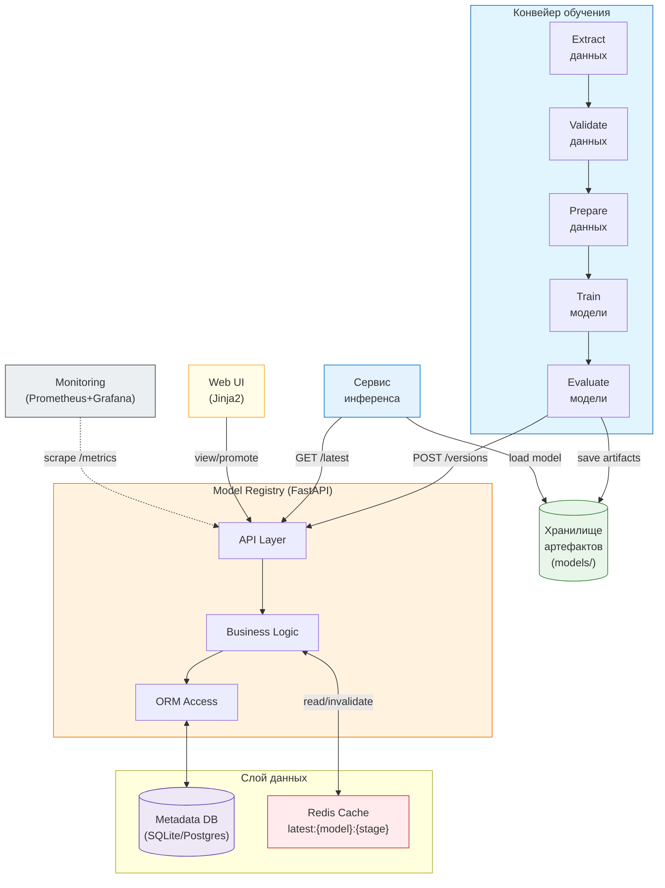

# Отчет по проектированию Model Registry

## 1. Анализ существующей ситуации

В текущей инфраструктуре ML-команды сохраняют обученные модели в общей файловой системе, используя произвольные имена папок:

```
models/
├── mlds_1/my_model_v1/
├── mlds_3/sft_modell_v_123/
├── mlds_180/model_v1_v0_with_rank_dataset_0/
├── mlds_180/model_v1_v0_with_rank_dataset_1/
└── mlds_180/model_v1_v0_without_rank_dataset_0/
```

**Выявленные проблемы:**

* Отсутствие единого стандарта именования и версионирования.
* Нет метаинформации о модели (метрики, гиперпараметры, автор, дата создания, источник данных).
* Невозможно определить, какая версия модели используется в производстве.
* Процесс выкатки модели в production выполняется вручную и подвержен ошибкам.
* Отсутствует аудит изменений и переходов между стадиями жизненного цикла (dev -> staging -> production).
* Нет возможности программно получить последнюю стабильную версию модели для инференса.

## 2. Требования к системе

### Функциональные требования

* **Управление моделями:** регистрация новой модели с указанием имени, описания, предметной области и владельца.
* **Управление версиями:** создание новой версии модели с сохранением:
  * пути к артефактам (веса, конфиги),
  * хеша git-коммита,
  * ссылки на данные,
  * гиперпараметров и метрик в формате JSON,
  * информации о среде обучения, версии пайплайна и идентификаторе запуска.
* **Жизненный цикл:** поддержка стадий `DEV` -> `STAGING` -> `PRODUCTION` -> `ARCHIVED`. При переводе версии в `PRODUCTION` предыдущая production-версия автоматически архивируется.
* **Получение последней версии:** API-метод для получения последней версии модели для указанной стадии (по умолчанию `PRODUCTION`).
* **Просмотр списка моделей и версий:** возможность получить все модели или детальную информацию по конкретной модели со всеми её версиями.
* **Веб-интерфейс:** минималистичный UI для просмотра моделей, версий и перевода версий в production.
* **Мониторинг:** экспорт метрик в формате Prometheus (количество запросов, время ответа для метода получения последней версии).

### Нефункциональные требования

* **Простота развертывания:** возможность запуска на локальной машине с использованием SQLite и без внешних зависимостей (Redis опционален).
* **Низкая задержка:** кэширование последней production-версии в Redis для быстрого доступа.
* **Расширяемость:** хранение параметров и метрик в JSON-полях позволяет добавлять любые атрибуты без изменения схемы БД.
* **API-first:** автоматическая генерация OpenAPI-документации.
* **Агностичность к ML-фреймворкам:** модель может быть обучена в любом фреймворке (PyTorch, TensorFlow и т.д.), регистр хранит только метаданные.
* **Надёжность:** корректная обработка конкурентных запросов при создании версий и смене стадий.

## 3. Архитектура системы

### 3.1. Схема компонентов



### 3.2. Описание компонентов

* **Конвейеры обучения (Training Pipelines):** процессы, которые готовят данные, обучают модель и сохраняют артефакты. После завершения обучения они отправляют запрос в Registry для регистрации новой версии.
* **Хранилище артефактов (Artifact Store):** файловая система, где хранятся веса модели, конфигурации, файлы с метриками и т.д. Путь к артефактам фиксируется в метаданных.
* **Сервис Model Registry:** ядро системы, реализованное на FastAPI. Предоставляет REST API для всех операций. Включает слой бизнес-логики (проверка уникальности имени, автоматическое присвоение номера версии, правила перевода стадий) и слой доступа к данным через SQLAlchemy.
* **База метаданных:** хранит информацию о моделях и версиях. В зависимости от окружения может быть SQLite (для разработки) или PostgreSQL (для продакшена).
* **Redis Кэш:** ускоряет получение последней версии для заданной стадии. Ключ инвалидируется при изменении стадии любой версии.
* **Сервис инференса:** внешний сервис, который перед запуском модели запрашивает последнюю production-версию, получает путь к артефактам и загружает модель.
* **Веб-интерфейс:** простые HTML-страницы, сгенерированные с помощью Jinja2, позволяющие просматривать модели и версии, а также выполнять promote в production.
* **Мониторинг:** Prometheus собирает метрики с эндпоинта `/metrics`, Grafana используется для визуализации.

## 4. Обоснование выбора технологий

| Компонент | Технология | Обоснование |
| :--- | :--- | :--- |
| **API-фреймворк** | FastAPI | Высокая производительность, автогенерация OpenAPI, удобная работа с Pydantic. |
| **ORM** | SQLAlchemy | Гибкий ORM, поддерживающий SQLite и PostgreSQL. Упрощает миграции. |
| **База данных** | SQLite / Postgres | SQLite для локальной разработки (0 зависимостей), Postgres для production. |
| **Кэширование** | Redis | Быстрое in-memory хранилище. Используется для кэша production-версий. |
| **Мониторинг** | Prom + Grafana | Стандартный стек observability. FastAPI легко интегрируется с prometheus_client. |
| **Веб-шаблоны** | Jinja2 | Встроен в FastAPI, позволяет быстро создать UI без отдельного фронтенда. |
| **ML-фреймворк** | PyTorch | Выбран для демо-скриптов (CNN на MNIST). Архитектура от фреймворка не зависит. |

## 5. Проектирование API и схемы БД

### 5.1. Схема базы данных

**Таблица `models` (Логические модели)**

| Поле | Тип | Описание |
| :--- | :--- | :--- |
| id | Integer (PK) | Уникальный идентификатор |
| name | String(255) | Уникальное имя модели |
| description | Text | Описание |
| domain | String(255) | Предметная область (fraud, cv и т.д.) |
| owner | String(255) | Владелец (команда) |
| created_at | DateTime | Дата создания |
| updated_at | DateTime | Дата обновления |

**Таблица `model_versions` (Версии моделей)**

| Поле | Тип | Описание |
| :--- | :--- | :--- |
| id | Integer (PK) | Уникальный идентификатор версии |
| model_id | Integer (FK) | Ссылка на таблицу models |
| version | Integer | Номер версии (автоинкремент) |
| stage | String(32) | Стадия: DEV, STAGING, PRODUCTION, ARCHIVED |
| artifact_path | Text | Путь к сохраненным файлам модели |
| git_commit | String(64) | Хеш коммита |
| data_ref | Text | Ссылка на используемый датасет |
| params_json | Text | JSON строка с гиперпараметрами |
| metrics_json | Text | JSON строка с метриками валидации |
| training_env | Text | Среда обучения (напр. cuda:0) |
| pipeline_version | String(64) | Версия пайплайна |
| run_id | String(64) | Идентификатор запуска |
| created_at | DateTime | Дата регистрации версии |
| created_by | String(255) | Автор версии |

### 5.2. API endpoints

| Метод | Endpoint | Назначение |
| :--- | :--- | :--- |
| POST | `/models` | Регистрация новой модели |
| GET | `/models` | Список всех моделей |
| GET | `/models/{name}` | Детальная информация по модели и список её версий |
| POST | `/models/{name}/versions` | Регистрация новой версии модели |
| POST | `/models/{name}/versions/{ver}/stage` | Изменение стадии (Promote) |
| GET | `/models/{name}/latest` | Получение последней версии для указанной стадии |
| GET | `/ui/models` | Веб-интерфейс: список моделей |
| GET | `/metrics` | Экспорт метрик в формате Prometheus |

#### Детали реализации

* При создании новой версии номер вычисляется автоматически (`max(version) + 1` для конкретной `model_id`).
* При переводе версии в `PRODUCTION` все предыдущие production-версии этой же модели автоматически переводятся в статус `ARCHIVED`.
* Кэширование применяется для эндпоинта `/latest`. При любом изменении стадии (через API или UI) кэш для затронутой модели инвалидируется.
* Поля параметров и метрик хранятся в БД как `Text`, но на уровне API обрабатываются как JSON-словари через Pydantic-схемы.
